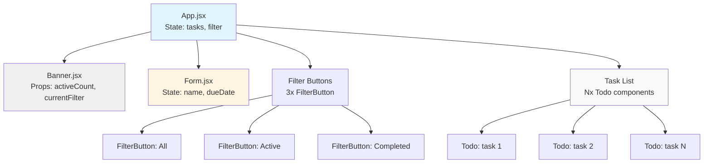
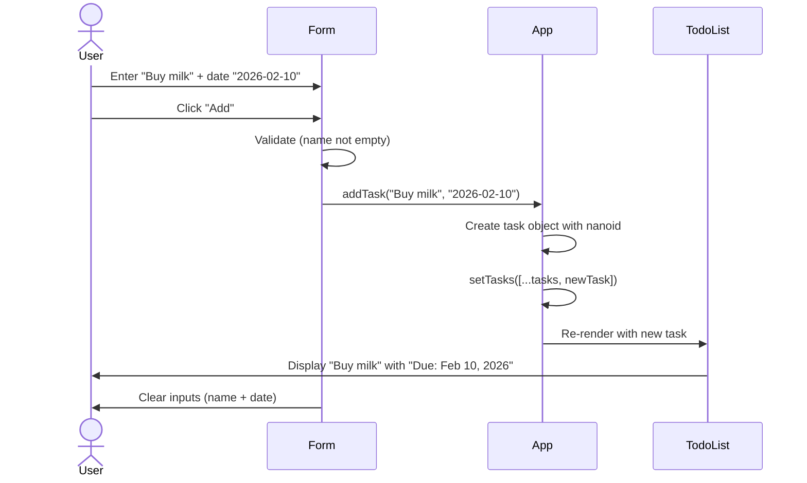
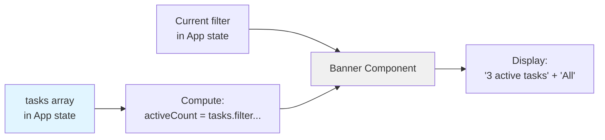

# Architecture & System Design: UI Enhancements + Due Dates

**Feature ID**: PRD-001, PRD-002, PRD-003  
**Version**: 1.0  
**Date**: 2026-02-06  
**Status**: Ready for Implementation

---

## 1. Feature Summary

**What**: Enhance the TodoMatic demo app with improved button styling (PRD-001), a top banner showing app info (PRD-002), and due date support for tasks (PRD-003).

**Who**: Demo users/students learning React patterns and accessibility best practices.

**Why**: Make the UI more demo-friendly and showcase additional React state management patterns (controlled date inputs, component composition, conditional rendering).

**Scope**: Client-side only, no persistence layer, minimal new dependencies (prefer native date inputs and CSS-only solutions).

---

## 2. UI/UX Behavior

### PRD-001: Button Styling
- **Primary actions** ("Add", "Save"): blue/green background, white text, clear hover state (lighten on hover).
- **Destructive actions** ("Delete"): red background (existing), darker red on hover.
- **Secondary actions** ("Edit", "Cancel"): neutral gray border, transparent background, darken on hover.
- **Filter buttons**: light gray when unselected, bold/underline when selected (existing `aria-pressed` state), subtle background on hover.
- All buttons maintain 3px dashed outline on `:focus-visible` (existing accessibility pattern).

**Empty/error states**: No change; existing behavior (no validation yet, per MDN tutorial pedagogy).

### PRD-002: Top Banner
- **Layout**: New horizontal bar at the top of `.todoapp`, above the `<h1>` title.
- **Content**:
  - **Left**: App title "TodoMatic" + subtitle "React + Vite demo".
  - **Right**: One dynamic info item (recommended: active task count, e.g., "3 active tasks").
- **Responsive**: On small screens (<550px), stack vertically or hide subtitle.
- **Visual**: light background (e.g., `#fafafa`), subtle bottom border, padding for breathing room.

**Empty state**: If no tasks, show "0 active tasks" (not hidden).

### PRD-003: Due Date
- **Add flow**: Optional date input field below task name in `<Form>`. Label: "Due date (optional)". Native `<input type="date">`.
- **View flow**: Each `<Todo>` shows due date below task name (if present), format "Due: Feb 4, 2026" (human-readable).
- **Edit flow**: Edit form includes date input (pre-filled if present). User can clear or update.
- **Empty state**: If no due date, show nothing (no placeholder text).
- **Visual**: Due date text in smaller, muted gray font; red/orange tint if date is in the past (stretch goal, optional).

---

## 3. Data Model

### Current Task Shape
```js
{
  id: "todo-abc123",       // string (nanoid)
  name: "Buy groceries",   // string
  completed: false         // boolean
}
```

### Updated Task Shape (PRD-003)
```js
{
  id: "todo-abc123",       // string (nanoid)
  name: "Buy groceries",   // string
  completed: false,        // boolean
  dueDate: "2026-02-10"    // string (ISO date) | null
}
```

**Constraints**:
- `dueDate` is optional (null/undefined if not set).
- Format: ISO 8601 date string (`YYYY-MM-DD`) for consistency with `<input type="date">` value format.
- No time component (day-level precision only).

### Example Tasks
```js
[
  { id: "todo-1", name: "Review PRD", completed: true, dueDate: "2026-02-05" },
  { id: "todo-2", name: "Write tests", completed: false, dueDate: "2026-02-08" },
  { id: "todo-3", name: "Read docs", completed: false, dueDate: null }
]
```

---

## 4. Component Impact Map

### Modified Files

| File | Change Type | Reason |
|------|-------------|--------|
| [src/App.jsx](../../src/App.jsx) | **Major** | Add banner component, update `addTask`/`editTask` to handle `dueDate` |
| [src/components/Form.jsx](../../src/components/Form.jsx) | **Major** | Add due date input field, update submit handler |
| [src/components/Todo.jsx](../../src/components/Todo.jsx) | **Major** | Display due date in view/edit templates, handle date in edit flow |
| [src/components/FilterButton.jsx](../../src/components/FilterButton.jsx) | **Minor** | No logic change (styling only via CSS) |
| [src/index.css](../../src/index.css) | **Major** | Add banner styles, button hover states, due date styles |
| [src/main.jsx](../../src/main.jsx) | **Minor** | Update initial task data to include `dueDate: null` (for consistency) |

### New Files
| File | Purpose |
|------|---------|
| [src/components/Banner.jsx](../../src/components/Banner.jsx) | **New** | Presentational component for top app banner (PRD-002) |

---

## 5. State & Data Flow

### Current State Architecture
- **Top-level state** (`App.jsx`): `tasks` (array), `filter` (string).
- **Form state** (`Form.jsx`): `name` (controlled input).
- **Todo state** (`Todo.jsx`): `isEditing` (boolean), `newName` (controlled input).

### Updated State Architecture (PRD-003)

```mermaid
graph TD
    User[User]
    App[App Component<br/>State: tasks, filter]
    Form[Form Component<br/>State: name, dueDate]
    Todo[Todo Component<br/>State: isEditing, newName, newDueDate]
    Banner[Banner Component<br/>Props: activeCount]
    FilterButton[FilterButton<br/>Props: name, isPressed]
    
    User -->|Add task| Form
    User -->|Edit task| Todo
    User -->|Toggle filter| FilterButton
    
    Form -->|addTask(name, dueDate)| App
    Todo -->|editTask(id, name, dueDate)| App
    Todo -->|deleteTask(id)| App
    Todo -->|toggleTaskCompleted(id)| App
    FilterButton -->|setFilter(name)| App
    
    App -->|tasks[]| Todo
    App -->|activeCount| Banner
    
    style App fill:#e1f5ff
    style Form fill:#fff4e1
    style Todo fill:#fff4e1
    style Banner fill:#f0f0f0
```

### Data Flow Changes

**Add Task (PRD-003)**:
1. User enters task name + optional due date in `<Form>`.
2. `Form` submits `{ name, dueDate }` to `App.addTask`.
3. `App` creates new task: `{ id, name, completed: false, dueDate }`.
4. `tasks` state updated → re-render → new `<Todo>` appears.

**Edit Task (PRD-003)**:
1. User clicks "Edit" → `<Todo>` enters edit mode.
2. `Todo` displays edit form with pre-filled `name` and `dueDate`.
3. User submits → `Todo` calls `props.editTask(id, newName, newDueDate)`.
4. `App` updates task in `tasks` array → re-render.

**Banner Data (PRD-002)**:
1. `App` computes `activeCount = tasks.filter(t => !t.completed).length`.
2. Passes `activeCount` as prop to `<Banner>`.
3. `Banner` renders "X active tasks" (no local state).

---

## 6. System Design Diagrams

### 6.1 Component Hierarchy



### 6.2 Add Task Flow (with Due Date)



### 6.3 Banner Data Flow



---

## 7. NFR Checklist

### Accessibility
- ✅ All new date inputs have associated `<label>` elements.
- ✅ Banner does not interfere with existing focus management (delete → heading focus).
- ✅ Due date text uses sufficient color contrast (gray must be ≥4.5:1 ratio).
- ✅ Filter button hover/selected states remain distinguishable for keyboard users (not color-only).
- ⚠️ Consider `aria-live` region for banner's dynamic count (low priority; not required for demo).

### Performance
- ✅ No new dependencies (native `<input type="date">` only).
- ✅ Banner computes `activeCount` in render (acceptable for small task lists; no memoization needed until 100+ tasks).
- ✅ CSS changes (button styles) do not trigger layout thrashing.

### Security/Privacy
- ✅ Due date is user-local data; no XSS risk (React escapes strings by default).
- ✅ ISO date format prevents injection (no freeform text parsing).
- ⚠️ If localStorage is added later, remind users that dates are visible in browser dev tools.

### Maintainability
- ✅ Task shape change is backward-compatible (`dueDate` defaults to `null`).
- ✅ Banner is isolated in its own component (easy to replace or remove).
- ✅ Date formatting logic centralized in `Todo.jsx` (consider utility function if reused).
- ✅ CSS changes follow existing naming conventions (`.btn__primary`, `.stack-large`, etc.).

---

## 8. Implementation Steps

### Phase 1: MVP (All PRDs)

1. **Update data model** ([src/main.jsx](../../src/main.jsx)):
   - Modify initial `tasks` array to include `dueDate: null` for existing tasks.

2. **Implement PRD-003 (Due Date) — Form** ([src/components/Form.jsx](../../src/components/Form.jsx)):
   - Add `dueDate` state variable.
   - Add `<input type="date" id="due-date-input">` below task name input.
   - Update `handleSubmit` to call `props.addTask(name, dueDate)`.
   - Clear `dueDate` state after submit.

3. **Implement PRD-003 (Due Date) — App** ([src/App.jsx](../../src/App.jsx)):
   - Update `addTask(name, dueDate)` to include `dueDate` in new task object.
   - Update `editTask(id, newName, newDueDate)` signature and logic.

4. **Implement PRD-003 (Due Date) — Todo** ([src/components/Todo.jsx](../../src/components/Todo.jsx)):
   - Add `newDueDate` state variable.
   - Add date input to edit template (pre-fill with `props.dueDate`).
   - Update `handleSubmit` to call `props.editTask(id, newName, newDueDate)`.
   - Display formatted due date in view template (if present): `{props.dueDate && <p className="todo-due-date">Due: {formatDate(props.dueDate)}</p>}`.
   - Add helper function `formatDate(isoString)` → "Feb 4, 2026".

5. **Implement PRD-002 (Banner)** ([src/components/Banner.jsx](../../src/components/Banner.jsx)):
   - Create new functional component.
   - Props: `activeCount`, `currentFilter`.
   - Render: `<div className="app-banner">` with title/subtitle/info.

6. **Integrate Banner** ([src/App.jsx](../../src/App.jsx)):
   - Compute `activeCount = tasks.filter(t => !t.completed).length`.
   - Render `<Banner activeCount={activeCount} currentFilter={filter} />` at top of JSX (before `<h1>`).

7. **Implement PRD-001 (Button Styling)** ([src/index.css](../../src/index.css)):
   - Add hover states for all button classes (`.btn:hover`, `.btn__primary:hover`, `.btn__danger:hover`).
   - Update `.toggle-btn[aria-pressed="true"]` to include background color.
   - Ensure contrast ratios meet WCAG AA.

8. **Add banner styles** ([src/index.css](../../src/index.css)):
   - `.app-banner`: flexbox layout, light background, padding, border-bottom.
   - `.app-banner__title`: bold, larger font.
   - `.app-banner__subtitle`: smaller, muted gray.
   - `.app-banner__info`: right-aligned.
   - Media query for mobile (stack vertically).

9. **Add due date styles** ([src/index.css](../../src/index.css)):
   - `.todo-due-date`: smaller font, gray color (`#6c757d`), margin-top.
   - Optional: `.todo-due-date--overdue` (red/orange) if date < today.

10. **Testing & validation**:
    - Run `yarn lint` (fix any issues).
    - Run `yarn build` (ensure no TypeScript/build errors).
    - Run `yarn preview` and manually test:
      - Add task with/without due date.
      - Edit task and change due date.
      - Verify banner shows correct active count.
      - Verify button hover states.
      - Test keyboard navigation (Tab, Enter, Esc).

### Phase 2: Polish (Optional Enhancements)

- **Overdue indicator**: Add red/orange styling to due dates in the past.
- **Date validation**: Prevent adding dates in the far past (e.g., before 2020).
- **Sort by due date**: Add filter option to sort tasks by due date.
- **Persistence**: Add localStorage support (separate design doc recommended).

---

## 9. Design Decisions & Trade-offs

### Decision 1: Native `<input type="date">` vs. Date Picker Library
**Chosen**: Native input.  
**Rationale**: Zero dependencies, accessible by default, consistent with project's "minimal dependencies" principle.  
**Trade-off**: Browser-dependent styling; some older browsers may fall back to text input (acceptable for demo).

### Decision 2: Date Format (ISO String vs. Timestamp)
**Chosen**: ISO string (`"YYYY-MM-DD"`).  
**Rationale**: Matches native input value format, human-readable, easy to parse.  
**Trade-off**: Timezone-agnostic (date-only, no time); acceptable for task due dates.

### Decision 3: Banner as Separate Component vs. Inline in App
**Chosen**: Separate `<Banner>` component.  
**Rationale**: Keeps `App.jsx` focused on state logic; banner is pure presentation.  
**Trade-off**: One extra file; justified by improved readability.

### Decision 4: Active Count vs. Total Count in Banner
**Chosen**: Active count ("3 active tasks").  
**Rationale**: More useful than total count (aligns with "X tasks remaining" heading).  
**Trade-off**: Could add total count as well; deferred to Phase 2.

---

## 10. Open Questions & Assumptions

### Assumptions
- No backend/API; all data client-side only.
- No localStorage in Phase 1 (future enhancement).
- Due dates do not affect filtering logic (e.g., no "overdue" filter in this phase).

### Open Questions (for developer)
- Should "Cancel" in edit mode reset the due date to original value, or keep user's edits? → **Recommend**: Reset (consistent with name reset).
- Should banner show current filter name ("Showing: Active") or just task count? → **Recommend**: Both (left: title/subtitle, right: "3 active tasks · Active filter").

---

## 11. Handoff Notes for Developer

### Files to Modify (in order)
1. `src/main.jsx` — Update initial data.
2. `src/components/Form.jsx` — Add due date input.
3. `src/App.jsx` — Update `addTask`/`editTask` signatures, add banner.
4. `src/components/Todo.jsx` — Add due date display/edit.
5. `src/components/Banner.jsx` — Create new component.
6. `src/index.css` — Add all styling (buttons, banner, due date).

### Key Implementation Details
- **Date helper function**: Suggest creating `utils/formatDate.js` if formatting logic grows.
- **Edit mode**: Pre-fill date input with `defaultValue={props.dueDate || ""}` (empty string if null).
- **Banner positioning**: Place before `<h1>` but inside `.todoapp` container.

### Testing Focus Areas
- Edge case: Add task with empty date field (should create task with `dueDate: null`).
- Edge case: Edit task and clear date field (should set `dueDate: null`).
- Accessibility: Verify all inputs have labels, focus states work correctly.
- Responsive: Test banner on narrow viewport (< 550px).

---

**End of Design Document**
